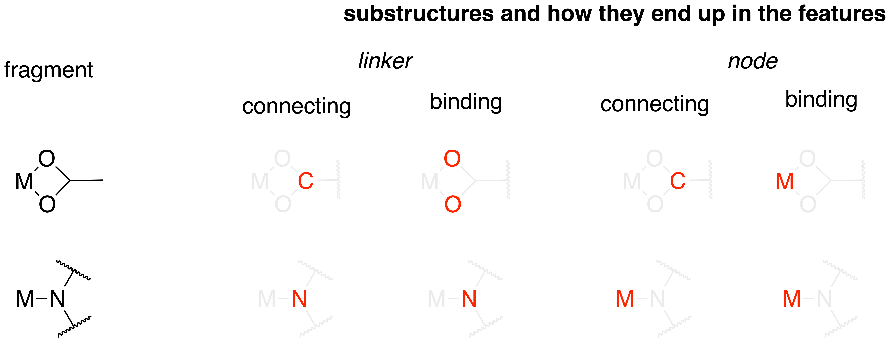

Background information
========================

Fragmentation
---------------
For the fragmentation of a MOF structure we rely on a structure graph. In moffragmentor we use heuristics in pymatgen to construct the structure graph (which is a networkx multigraph with annotation about the periodic neighbors). If the structure graph does not contain a pair of bonds, moffragmentor cannot consider it in the fragmentation.

.. warning::
    The current implementation of the fragementation is in parts
    relatively inefficient as we perform multiple traversals of the structure graph.

For the fragmentation, there are a few definitions we have to make:

.. topic:: **Bridge**

    In a graph, a `bridge <https://en.wikipedia.org/wiki/Bridge_(graph_theory)>`_ is an edge, if removed, would increase the number of connected components.

.. topic:: **Bound solvent**

    A bound solvent molecule is bound via a bridge egde to one metal. Accroding to this definition, M-OCH\ :sub:`3`, M-OH\ :sub:`2`, etc. are all bound solvents, whereas a bridging formate is not.

.. topic:: **Floating solvent**

    Floating solvent is an isolated connected component in the structure graph that does not lie across periodic boundaries in a supercell.

.. topic:: **Branching site**

    A branching site is a site with at least three non-bridge edges. A branching site is connected to at least two non-metal elements.
    A branching site that can only be reached from a metal by crossing another branching site is not a valid branching site.

.. topic:: **Capping site**

    A capping site is part of a cycle with one of more metals that does not contain a branching site.

For the fragmentation branching sites define the places at which we make the split between node and linker.
The fragmentation algorithm goes through the following steps:

0. Extracting floating solvent.
1. From metal sites perform depth-first search on the structure graph up to a branching site.
2. "Complete graph" by traversing the graph from all non-branching sites traversed in step 1 up to a leaf node.
3. Extracting nodes as separate connected components.
4. Deleting nodes from the structure graph and extracting linkers as connected components.

SBU dimensionality
--------------------

For many applications, the dimensionality of the SBUs can be of interest [Rosi2005]_. For example, one can hypothesize that 1D nodes can have favorable charge conductance properties. Also, such rod SBUs may prevent interpenetration [Rosi2005]_.

To compute the dimensionality of the building blocks we use the algorithm proposed by Larsen et al. [Larsen2019]_.

SBU descriptors
------------------

One key intuition MOF chemists have is that the shape of the building blocks dictates which MOF will form. This is discussed in great detail in [Kalmutzki2018]_. Also, chemists know that it can be difficult to form MOFs with highly flexible linkers [Lin2014]_. In other contexts, it already has been shown that flexibility is associated with a molecules tendency to form crystals [Wicker2015]_.

Chemical descriptors
.......................

From general chemistry we know that the hardness/softness of the connecting atoms are likely most relevant for predicting the bond formation tendency (see `HSAB principle <https://en.wikipedia.org/wiki/HSAB_theory>`_)

Geometrical descriptors
.........................

- Based on the branching index coordinates, we calculated local structure order parameters [Zimmermann2020]_. One can think of those structure order parameters as similarity measures to "ideal" coordination polyhedra. That is, the octahedral order parameter would measure the distance of the actual coordination polyhedron to an "ideal" octahedron.

Flexibility descriptors
.........................

To capture the flexibility of the building blocks we compute

- the `rotable bond count <http://rdkit.org/docs/source/rdkit.Chem.rdMolDescriptors.html#rdkit.Chem.rdMolDescriptors.CalcNumRotatableBonds>`_
- the :code:`nConf20` descriptor, proposed in [Wicker2016]_ which samples accessible conformer space.
- the Kier flexibility index [Kier1989]_

All those descriptors operator on RDKit molecules (with enumerated conformers) and hence are only reliable for the organic linkers.

Net Embedding
----------------

A key concept in reticular chemistry is the one of the net. Computing the topology of the net embedding is not entirely trivial as there is no specific rule of of clusters of atoms should be condensed to a vertex [Bureekaew2015]_ (for example, `one might place vertices on subfragments of large linkers <https://www.mofplus.org/content/show/generalnetinfo>`_.
In moffragmentor, we use the centers of node and linker clusters as vertices. Using the `Systre code <http://gavrog.org/Systre-Help.html>`_ [DelagoFriedrichs2003]_, we can then determine the `RCSR <http://rcsr.anu.edu.au/rcsr_nets>`_ code of this net.

References
-------------

.. [Rosi2005] Rosi, N. L. et al. Rod Packings and Metal−Organic Frameworks Constructed from Rod-Shaped Secondary Building Units. J. Am. Chem. Soc. 127, 1504–1518 (2005).

.. [Larsen2019] Larsen, P. M., Pandey, M., Strange, M. & Jacobsen, K. W. Definition of a scoring parameter to identify low-dimensional materials components. Phys. Rev. Materials 3, (2019).

.. [Kalmutzki2018] Kalmutzki, M. J., Hanikel, N. & Yaghi, O. M. Secondary building units as the turning point in the development of the reticular chemistry of MOFs. Sci. Adv. 4, eaat9180 (2018).

.. [Wicker2015] Wicker, J. G. P. & Cooper, R. I. Will it crystallise? Predicting crystallinity of molecular materials. CrystEngComm 17, 1927–1934 (2015).

.. [Wicker2016] Wicker, J. G. P. & Cooper, R. I. Beyond Rotatable Bond Counts: Capturing 3D Conformational Flexibility in a Single Descriptor. J. Chem. Inf. Model. 56, 2347–2352 (2016).

.. [Lin2014] Lin, Z.-J., Lü, J., Hong, M. & Cao, R. Metal–organic frameworks based on flexible ligands (FL-MOFs): structures and applications. Chem. Soc. Rev. 43, 5867–5895 (2014).

.. [Kier1989] Kier, L. B. An Index of Molecular Flexibility from Kappa Shape Attributes. Quant. Struct.-Act. Relat. 8, 221–224 (1989).

.. [Zimmermann2020] Zimmermann, N. E. R. & Jain, A. Local structure order parameters and site fingerprints for quantification of coordination environment and crystal structure similarity. RSC Adv. 10, 6063–6081 (2020).

.. [Bureekaew2015] Bureekaew, S., Balwani, V., Amirjalayer, S. & Schmid, R. Isoreticular isomerism in 4,4-connected paddle-wheel metal–organic frameworks: structural prediction by the reverse topological approach. CrystEngComm 17, 344–352 (2015).

.. [DelagoFriedrichs2003] Delgado-Friedrichs, O. & O’Keeffe, M. Identification of and symmetry computation for crystal nets. Acta Cryst Sect A 59, 351–360 (2003).
