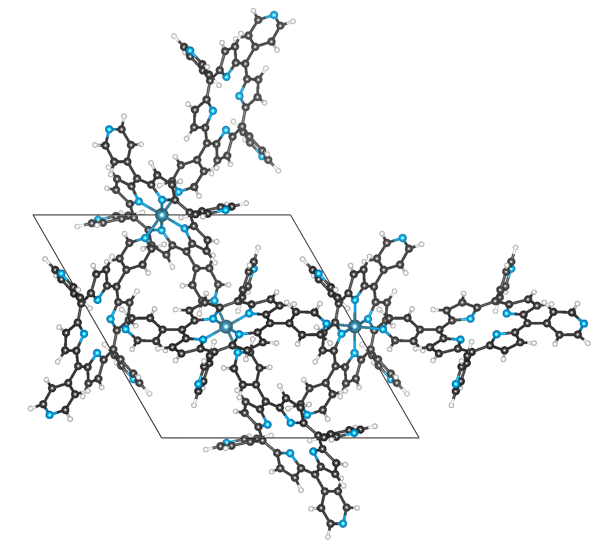

Getting started with moffragmentor
====================================

Installation
---------------

We recommend installing moffragmentor in a clean virtual environment environment (e.g., a `conda environment <https://docs.conda.io/projects/conda/en/latest/index.html>`_)

You can install the latest stable release from PyPi using

.. code-block:: bash

    pip install moffragmentor

or the latest development version using

.. code-block:: bash

    pip install git+https://github.com/kjappelbaum/moffragmentor.git

Extensions
...........

In case you want to use the :py:meth:`~moffragmentor.SBU.Node.show_molecule`, or :py:meth:`~moffragmentor.mof.MOF.show_structure` function in Jupyter lab you have to

.. code-block:: bash

    jupyter-labextension install @jupyter-widgets/jupyterlab-manager
    jupyter-labextension install nglview-js-widgets
    jupyter-nbextension enable nglview --py --sys-prefix

You also might find the `debugging help in the nglview documentation <https://github.com/nglviewer/nglview/blob/master/docs/FAQ.md#widget-not-shown>`_ useful.

Fragmenting a MOF
-------------------

To fragment a MOF you need to create an instance of :py:class:`~moffragmentor.mof.MOF` and then call :py:meth:`~moffragmentor.mof.MOF.fragment`.

.. code-block:: python

    from moffragmentor import MOF

    mof = MOF.from_cif(<my_cif.cif>)
    fragmentation_result = mof.fragment()

The result is an :code:`FragmentationResult` :code:`namedtuple` with the fields :code:`nodes`, :code:`linkers`,
both subclasses of of a :py:class:`moffragmentor.sbu.SBUCollection` and  :code:`bound_solvent`, :code:`unbound_solvent`, both :py:class:`moffragmentor.molecule.NonSbuMoleculeCollection`, as well as a :py:class:`moffragmentor.net.Net`.

.. warning::

    Note that moffragmentor currently does not automatically delete bound solvent. This is due to two observations:

    1. We have very little understanding of what solvent we can remove without affecting the structural integrity.
    2. We (currently) do not have a way to estimate if a solvent is charged. We explore different implementation strategies but we do not have a robust one at this moment.

You might want a quick overview of the composition of the different components. You can access this via the :code:`composition` properties

.. code-block:: python

    solvent_collection.composition

which will return a dictionary of the counts of the compositions, for example :code:`{'C3 H7 N1 O1': 3, 'H2 O1': 4}`.

Clearly, we do not consider floating solvent for the computation of the net.

Known issues
----------------

For some structures in the CSD MOF subset, there will be problems with the fragmentation.
One example is :code:`CAYSIE`, which is a metalloporphyrinate. Here, the code struggles to distinguish nodes and linkers as a core routine of the fragmentor is to check if a metal atoms is inside another, potential linker, molecule.

    Example of a metalloporphyrinate for which the fragmentor fails.

Calculating descriptors
--------------------------

A key feature of moffragmentor is that it can compute relevant descriptors of building blocks.

Modifying a building block
-------------------------------
